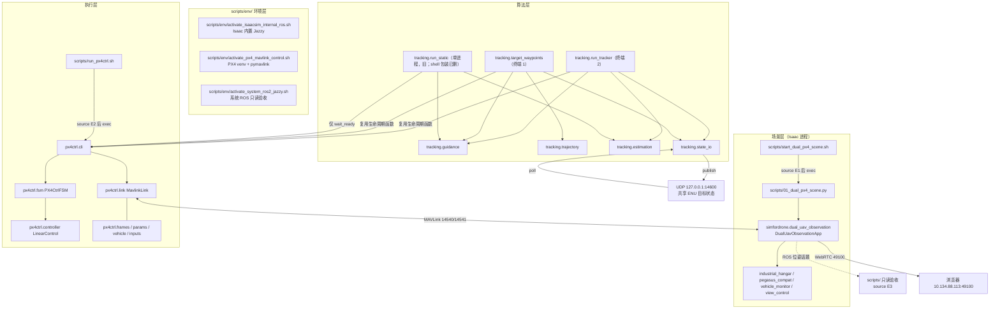

# 项目调用关系整理

本文回答一个问题：**从敲下命令到无人机动作，中间经过了哪些层、哪些文件、哪些进程。**
操作步骤请配合 [runbook.md](runbook.md) 使用；本文只讲“怎么被调用”和“职责边界”。

---

## 1. 分层与唯一出口

```text
┌─ 环境层 env/ ─────────────────────────────────────────────────────┐
│  三个互斥的运行时画像，各自 unset 掉对方的环境变量                  │
└───────────────────────────────────────────────────────────────────┘
┌─ 场景层 scripts/ + src/simfordrone/ ──────────────────────────────┐
│  Isaac Sim 进程：建场景、跑物理、发 ROS 位姿、出 WebRTC 画面        │
│  绝不发 MAVLink 控制指令                                          │
└───────────────────────────────────────────────────────────────────┘
┌─ 执行层 px4ctrl/ ─────────────────────────────────────────────────┐
│  唯一 MAVLink 出口。link 收 / 解包，controller 算，fsm 定状态       │
└───────────────────────────────────────────────────────────────────┘
┌─ 算法层 tracking/ ────────────────────────────────────────────────┐
│  guidance 算期望、trajectory 规划、estimation 估计、state_io 转发   │
│  只产出 DesiredState / CommandData，不碰 MAVLink 与 isaacsim        │
└───────────────────────────────────────────────────────────────────┘
```

三条铁律（违反任意一条都会出现“命令发给了错误的无人机”这类最难查的故障）：

| 规则 | 含义 |
|---|---|
| **MAVLink 只从 `px4ctrl.link` 出** | 算法层与场景层都不直接收发 MAVLink；`link.py` 是唯一 socket 出口 |
| **一个 MAVLink 端口只属于一个进程** | 14540 归 target 进程，14541 归 tracker 进程；同端口再开第二个进程会互相抢报文 |
| **算法层不 import isaacsim / pegasus / omni** | 保证 `tracking/` 可脱离仿真单测（25 项测试正是靠这条才可跑） |

---

## 2. 总调用图



---

## 3. 三条启动路径

### 3.1 推荐：场景 + 两个独立控制进程（当前主用）

必须在**三个终端**分别启动，顺序有依赖：

```bash
# 终端 0：场景（先启动，等 PX4 起完、WebRTC 可连）
./scripts/start_dual_px4_scene.sh

# 终端 1：只控制 target（14540），并把共享 ENU 状态发出去
./scripts/run_target_waypoints.sh --interactive --execute

# 终端 2：只控制 tracker（14541），并订阅 target 状态
./scripts/run_tracker.sh --duration 0 --execute
```

调用链逐层展开：

```text
终端 0  ./scripts/start_dual_px4_scene.sh
        └─ 子 shell: source scripts/env/activate_isaacsim_internal_ros.sh
           └─ cd logs/nvstreamer && exec isaacsim-5.1.0/python.sh scripts/01_dual_px4_scene.py
              └─ SimulationApp(headless, hide_ui=False) + enable_extension(ros2.bridge, livestream.nvcf)
                 └─ sys.path += src/ 与 PegasusSimulator/extensions/pegasus.simulator
                    └─ DualUavObservationApp(simulation_app).run()
                       ├─ industrial_hangar.py       加载 USD 环境
                       ├─ pegasus_compat.py          为 Isaac 5.1 打补丁（如深度图 ROS 标记）
                       ├─ Pegasus 启动 instance 0/1 → PX4 SITL instance 0/1
                       │     └─ PX4 侧: 14540 → instance 0 (sysid 1) / 14541 → instance 1 (sysid 2)
                       ├─ vehicle_monitor.py          HUD 写入视频流
                       └─ view_control.py             解析本终端输入的视角命令

终端 1  ./scripts/run_target_waypoints.sh
        └─ source scripts/env/activate_px4_mavlink_control.sh   （清掉 Conda/ROS 变量，锁定 PX4 venv）
           └─ exec PX4-Autopilot/.venv/bin/python -m tracking.target_waypoints
              ├─ px4ctrl.params.load_params(config/sim.yaml)
              ├─ px4ctrl.vehicle.resolve_role("target") → udpin:0.0.0.0:14540, sysid 1
              ├─ px4ctrl.link.MavlinkLink(14540)
              ├─ px4ctrl.cli.wait_ready / enter_offboard          ← 复用执行层的生命周期
              ├─ px4ctrl.fsm.PX4CtrlFSM + px4ctrl.controller.LinearControl
              ├─ tracking.trajectory.WaypointSegment.sample()      → 位置/速度前馈
              ├─ tracking.state_io.TargetStatePublisher.publish()  → UDP 14600
              └─ px4ctrl.cli.finish() → 降落 → 上锁

终端 2  ./scripts/run_tracker.sh
        └─ source scripts/env/activate_px4_mavlink_control.sh
           └─ exec PX4-Autopilot/.venv/bin/python -m tracking.run_tracker
              ├─ px4ctrl.vehicle.resolve_role("tracker") → udpin:0.0.0.0:14541, sysid 2
              ├─ tracking.state_io.TargetStateSubscriber.poll()    ← UDP 14600，非阻塞
              ├─ tracking.estimation.select_target_state(source=truth|estimator)
              │     └─ NoisyTargetSensor / PassthroughEstimator
              ├─ tracking.guidance.PositionTrackerV0.compute()     → DesiredState
              ├─ px4ctrl.inputs.CommandData（带 recv_time）
              ├─ px4ctrl.fsm.PX4CtrlFSM
              │     └─ px4ctrl.controller.LinearControl.calculate_control()
              └─ px4ctrl.link.send_attitude_thrust()               → 14541
```

### 3.2 单进程双机（早期形态，`run_static.py`）

一个进程内同时开两个 `MavlinkLink`（14540 + 14541）控制两台机，只能跑固定脚本，
无法手动输入航点，也不经过 UDP 状态转发（真值在进程内直接共享）。**shell 包装
`scripts/run_tracking.sh` 已删除**，模块保留，需要时直接调用：

```bash
export SIMFORDRONE_ROOT=/data/disk2/home/hl/research/SimForDrone
source scripts/env/activate_px4_mavlink_control.sh
PYTHONPATH=tracking:px4ctrl "${SIMFORDRONE_PX4_PYTHON}" -m tracking.run_static --execute
```

它对起飞与降落有自己的双机实现（`enter_offboard_both` / `land_both`），
只从 `px4ctrl.cli` 借用 `wait_ready`。

> 已被 3.1 取代；模块保留为最小的端到端回归用例，排查“是不是多进程引入的问题”时可用。

### 3.3 只读验收（不发任何控制指令）

```bash
./scripts/check_dual_uav_observation.sh   # source 系统 ROS，检查话题是否齐全
./scripts/capture_rgbd_sample.sh          # 采一组 RGB-D 到 logs/rgbd_samples/
./scripts/check_observer_rgb_scene.sh     # 检查画面可读性
./scripts/show_latest_tracking_result.sh  # 汇总 logs/tracking/ 最新结果
```

（原 `record_tracker_takeoff_pose.sh` 已删除：P2.0 起降核验统一由 px4ctrl 负责；ROS-only
记录器仍可用 `/usr/bin/python3 utils/record_tracker_takeoff_pose.py` 直接调用。）

这些脚本统一 `source scripts/env/activate_system_ros2_jazzy.sh` 并用 `/usr/bin/python3`，
**与两个控制进程完全隔离**，因此可以随时运行，不影响飞行。

---

## 4. 环境层：三个画像为什么必须分开

| 脚本 | 谁 source | 提供的 Python | 关键点 |
|---|---|---|---|
| `scripts/env/activate_isaacsim_internal_ros.sh` | 场景脚本的**子 shell** | Isaac 自带 Python 3.11 + 内置 Jazzy | `LD_LIBRARY_PATH` 只指向 Isaac 的 Jazzy，拼上 `/opt/ros/jazzy/lib` 会段错误；还会 `unset DISPLAY/XAUTHORITY` 以强制无头 |
| `scripts/env/activate_px4_mavlink_control.sh` | `scripts/run_px4ctrl.sh`、`scripts/run_*.sh` | `PX4-Autopilot/.venv/bin/python`（有 pymavlink，**无 rclpy**） | `unset PYTHONPATH/CONDA_*/LD_LIBRARY_PATH`，把 Conda 挡在外面 |
| `scripts/env/activate_system_ros2_jazzy.sh` | `scripts/check_*.sh`、`scripts/capture_*.sh` | `/usr/bin/python3` + `/opt/ros/jazzy`（有 rclpy，**无 pymavlink**） | 只读验收专用 |

**不要在同一终端里混用。** 典型症状：控制脚本里 `import rclpy` 失败（本来就不该有），
或场景启动时报 `librmw` 符号错误（系统 ROS 被带进去了）。

---

## 5. 进程间通信一览

| 通道 | 地址 | 方向 | 载荷 | 定义处 |
|---|---|---|---|---|
| MAVLink | UDP `14540` | PX4(instance 0) ↔ target 进程 | 心跳、`SET_ATTITUDE_TARGET`、遥测 | `px4ctrl/vehicle.py` `_ROLES` |
| MAVLink | UDP `14541` | PX4(instance 1) ↔ tracker 进程 | 同上 | 同上 |
| 共享目标状态 | UDP `127.0.0.1:14600` | target 进程 → tracker 进程 | `StampedTargetState`(JSON) | `tracking/state_io.py` |
| ROS 2 位姿 | `/target_uav_0/state/pose`、`/tracker_uav_1/state/pose` | 场景 → 任何订阅者 | Pegasus 真值位姿 | `vehicle.py` `pose_topic` |
| ROS 2 相机 | `/<ns><id>/...` RGB/Depth/CameraInfo | 场景 → 订阅者 | 图像与内参 | `pegasus_compat.py` 补深度标记 |
| WebRTC | `10.134.88.113:49100` | 场景 → 浏览器 | 画面 + 合成 UI | `start_dual_px4_scene.sh` |
| 锁步同步 | TCP `4560`/`4561` | Isaac ↔ PX4 ×2 | 仿真时钟同步 | Pegasus |

坐标约定：控制器内部统一 **ENU/FLU**，PX4 是 **NED/FRD**，两者只在
`px4ctrl/frames.py` 与 `px4ctrl/link.py` 里转换。跨进程的“共享系”用 Pegasus 球面
`EARTH_RADIUS = 6353000.0`（WGS-84 会带来约 0.5% 的东向尺度误差）。

---

## 6. 参数从哪来

```text
configs/dual_uav_hangar.yaml          场景侧：双机初始位姿、相机、环境 USD、rotor_input_scaling
        ↓ 读取者 src/simfordrone/config.py（环境变量 SIMFORDRONE_CONFIG 可切换）
px4ctrl/config/sim.yaml               控制侧：增益 Kp/Kv、倾角限幅、hover_percentage、超时、tasks 默认值
        ↓ 读取者 px4ctrl/params.py（CLI --config 可覆盖，--profile real 切 real.yaml）
命令行参数                            优先级最高；未给出时才回落到 YAML 的 tasks 段
```

两层标定不要混：`rotor_input_scaling`（2000）是**被控对象**的 PX4 输出→转速增益，
`hover_percentage`（0.2893）是**控制器**的推力模型，互不可替代。

---

## 7. 产物与日志

| 路径 | 产生者 | 内容 |
|---|---|---|
| `logs/isaac_px4/dual_px4_<时间>.log` | 场景脚本 | Isaac/PX4 完整输出，崩溃排查第一现场 |
| `logs/nvstreamer/*.etli` | NvStreamer（进程 cwd） | WebRTC 跟踪日志，无法关闭，由脚本截断到 64 MB × 2 份 |
| `logs/px4ctrl/<task>-<role>-<时间>/run.json` | `px4ctrl.cli` | 单机任务遥测与结论，保留最近 20 次 |
| `logs/tracking/tracker-v0-<时间>/run.json` | `run_tracker` | 跟踪误差时间序列 |
| `logs/rgbd_samples/`、`logs/scene_rgb_checks/` | `utils/` | 视觉验收样本 |

---

## 8. 排查对照表

| 症状 | 先看哪一层 |
|---|---|
| 控制脚本连不上飞控 / 一直 `wait_ready` 超时 | 场景是否在跑、PX4 是否起来；`pgrep -f px4` 与端口占用 |
| 两个控制进程都收到对方的心跳 | 端口是否重复绑定（14540/14541 被同一进程用了两次） |
| `Disarming denied: not landed` | `px4ctrl.cli.finish()`；已知需 `force` 兜底 |
| tracker 说目标状态超时 | 终端 1 是否在发、`--state-port` 是否一致、UDP 14600 是否被防火墙挡 |
| `import rclpy` 失败 / `librmw` 符号错 | 环境层用错了画像（见第 4 节） |
| WebRTC 连不上 | TCP 49100 只代表信令通，视频走 UDP 47998，需同时放行 |
| 长时间运行后 EKF 告警、高度漂移 | 每轮飞行前重启场景，不要复用运行了数小时的实例 |
| 视角被“锁死”无法鼠标拖动 | 按 `0` 回手动模式（默认已是 `0`） |
