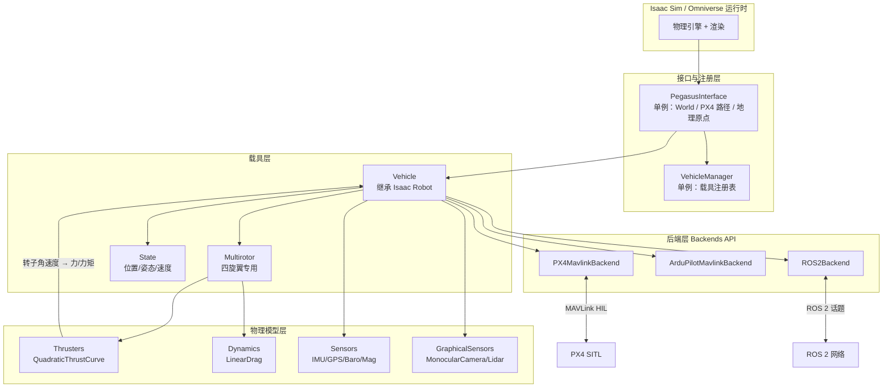
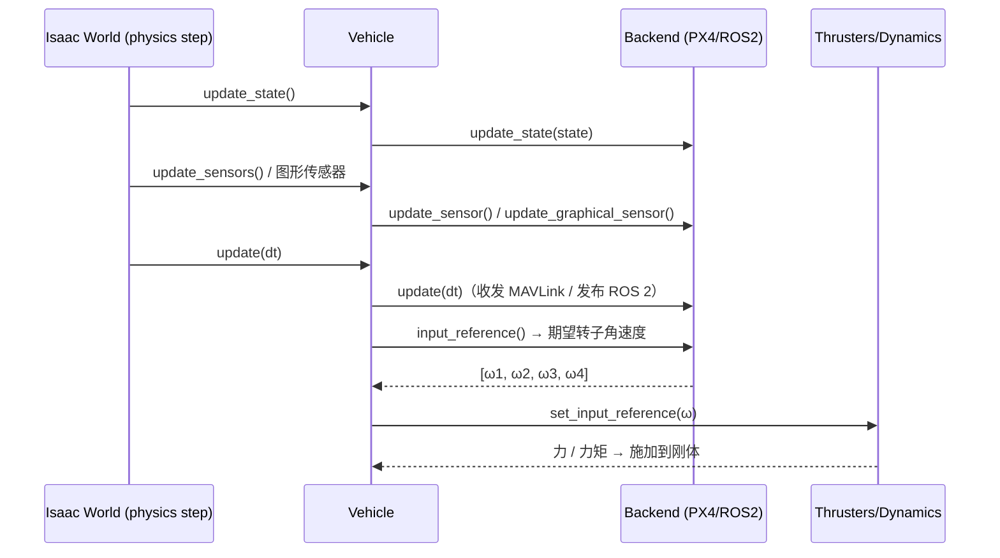
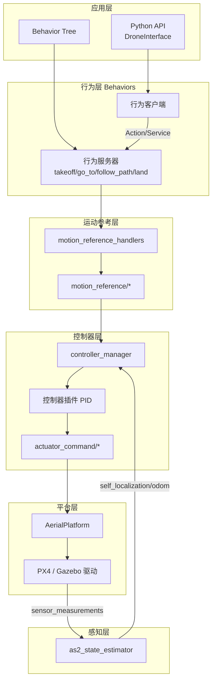
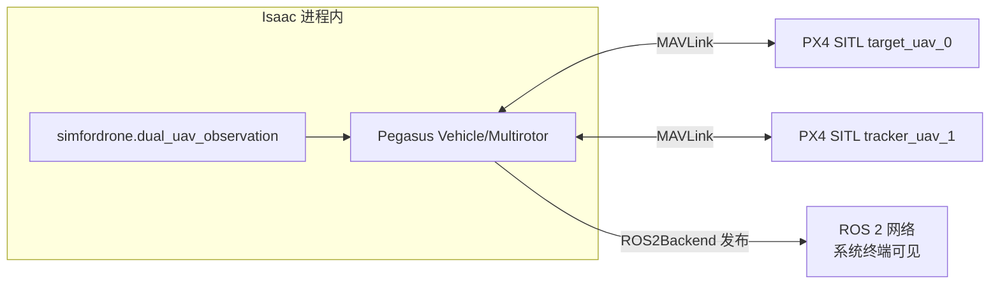
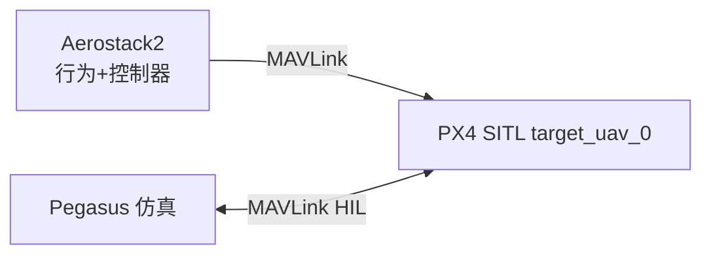

# PegasusSimulator 与 Aerostack2 架构解读

本文解读工程中两套第三方框架的架构、各自职责，以及它们在 SimForDrone 中的位置。
读者对象是后续要接入控制闭环与视觉位姿的作者。

当前固定版本（以仓库内实际提交为准）：

| 组件 | 版本 / 提交 | 目录 |
|---|---|---|
| PegasusSimulator | `v5.1.0`（`644da37`），面向 Isaac Sim 5.1.0 | `PegasusSimulator/` |
| PX4-Autopilot | `v1.18.0-beta1-577-g3ebb2923a1` | `PX4-Autopilot/` |
| Aerostack2 | `1.1.3-239-gd8b150a9`（上游 `main`，**未修改**） | `aerostack2/` |

> 重要前提：`SimForDrone/aerostack2` 是上游仓库的**纯净副本**（`git status` 干净，无本地提交），
> 目前尚未被工程引用。它代表"后续控制闭环集成"的目标软件栈，而不是已接入的运行时。

---

## 1. 一句话区分两套框架

| | PegasusSimulator | Aerostack2 |
|---|---|---|
| 本质 | Isaac Sim 上的**动力学与传感器仿真框架** | ROS 2 上的**多无人机自主飞行软件栈** |
| 解决的问题 | "无人机在仿真世界里怎么飞、传感器读数从哪来" | "任务怎么描述、行为怎么编排、控制怎么闭环" |
| 运行宿主 | Isaac Sim / Omniverse（Python，扩展模式） | ROS 2 Jazzy（C++ 节点 + Python API） |
| 对外接口 | MAVLink（PX4/ArduPilot）、ROS 2 话题 | ROS 2 话题/服务/动作、Python `DroneInterface` |
| 是否含飞控 | 不含；把控制交给 PX4/ArduPilot SITL | 不含飞控硬件；只做上层自主逻辑 |
| 在 SimForDrone 中的角色 | **已接入**：提供双机仿真、PX4 SITL、ROS 2 观测接口 | **未接入**：预留的控制闭环框架 |

二者不是替代关系，而是**纵向叠加**：Pegasus + PX4 提供"被控对象与传感器"，
Aerostack2 提供"决策与控制"。真实工程里 Aerostack2 也可以直接对接真机 PX4，与 Pegasus 无关。

---

## 2. PegasusSimulator 架构

### 2.1 分层总览



### 2.2 核心类与职责

| 类 / 文件 | 职责 |
|---|---|
| `PegasusInterface`（单例） | 管理 Isaac `World`、世界原点经纬高、PX4/ArduPilot 安装路径；`load_environment()` 加载场景 |
| `VehicleManager`（单例，带锁） | 记录所有已生成载具；载具构造时自动注册，析构时移除 |
| `Vehicle`（继承 `isaacsim.core.api.robots.Robot`） | 生成 USD 载具图元、挂物理/时间线回调、挂传感器与后端 |
| `Multirotor` | 四旋翼：把后端给出的**转子角速度**经推力曲线转成力/力矩并施加 |
| `State` | 保存载具当前位姿、速度、角速度等，供后端与传感器读取 |
| `Backend` / `BackendConfig`（抽象基类） | 定义通信/控制后端模板：`update_state` / `update_sensor` / `update_graphical_sensor` / `input_reference` / `update` / `start` / `stop` / `reset` |
| `PX4MavlinkBackend` | 与 PX4 SITL 通过 MAVLink 交互，可自动拉起/关闭 PX4 进程 |
| `ArduPilotMavlinkBackend` | ArduPilot 实验性接口 |
| `ROS2Backend` | 通过 Isaac 内置 `isaacsim.ros2.bridge` 发布状态/传感器、订阅控制 |
| `Sensor`（IMU/GPS/Barometer/Magnetometer） | 数值传感器，按各自频率产生数据 |
| `GraphicalSensor`（`MonocularCamera`、`Lidar`） | 基于渲染的传感器，经 ROS 2 writer（Replicator）异步发布 |
| `LinearDrag` / `QuadraticThrustCurve` | 气动阻力与推力曲线模型 |

### 2.3 每个物理步的数据流

`Vehicle` 在构造时向 `World` 注册三类回调：



关键点：**后端是唯一"对外说话"的组件**。车辆内部不知道 PX4 或 ROS 2 的存在，
只向后端要"转子角速度"，把仿真状态喂给后端。这使 PX4 / ArduPilot / ROS 2 / 自定义后端可自由替换。

### 2.4 PX4 SITL 集成与推力标定

`PX4MavlinkBackendConfig` 的关键参数：

| 参数 | 含义 |
|---|---|
| `vehicle_id` | 载具编号，决定 MAVLink 端口 `connection_baseport + vehicle_id` |
| `connection_type` / `connection_baseport` | MAVLink 连接方式与基础端口（默认 `tcpin:4560`） |
| `enable_lockstep` | 锁定步长，让 PX4 与 Isaac 物理严格同步 |
| `input_scaling` / `input_offset` / `zero_position_armed` | 把 PX4 下发的归一化 `HIL_ACTUATOR_CONTROLS` 映射到转子角速度 |
| `px4_autolaunch` / `px4_dir` / `px4_vehicle_model` | 是否自动拉起 PX4、路径与机型 |

仿真 → PX4 方向发送 `HIL_SENSOR`、`HIL_GPS`、`HIL_STATE_QUATERNION` 等；
PX4 → 仿真方向返回 `HIL_ACTUATOR_CONTROLS`（归一化控制量）。

> **SimForDrone 的推力标定就在 `input_scaling`**：PX4 的 `HIL_ACTUATOR_CONTROLS`
> 是归一化量，Pegasus 默认增益 `1000` 只能产生约 8 N 总推力，低于 Iris 离地需求。
> 工程通过环境变量 `SIMFORDRONE_PX4_INPUT_SCALING`（当前 `2000`）覆盖，
> 只改"PX4 输出→物理推力"的映射，不动飞控参数。见 `src/simfordrone/dual_uav_observation.py`。

### 2.5 ROS2Backend

- 采用 Isaac Sim 内置的 `isaacsim.ros2.bridge`（Jazzy + Fast DDS），**不是**系统 ROS 2。
- 通过参数控制发布/订阅开关：`pub_state`、`pub_sensors`、`pub_graphical_sensors`、`pub_tf`、`sub_control`。
- 默认话题前缀为 `namespace`，例如 `namespace="tracker_uav_"` 会产生
  `/tracker_uav_0/state/pose`、`/tracker_uav_1/state/pose` 等（注意命名空间末尾的下划线）。
- 图形传感器数据经 Replicator writer 在**独立线程**从 GPU 搬到 CPU 后发布，避免阻塞物理步。
- `pub_tf` 默认关闭：Isaac 进程内的 `tf2_ros` Python 与系统 ROS 2 的 `tf2` 扩展不能混用，
  机体/相机 TF 由项目适配层统一发布，以便坐标约定可审计。

---

## 3. Aerostack2 架构

### 3.1 分层与数据流



### 3.2 包职责一览

| 包 | 作用 |
|---|---|
| `as2_core` | 基础库：`as2::Node`、`AerialPlatform`、`BasicBehavior`、`PlatformStateMachine`、`Sensor`、命名常量（topics/services/actions）、TF/GPS/控制模式等工具 |
| `as2_msgs` | 全部自定义 msg / srv / action，框架的接口契约 |
| `as2_aerial_platforms` | 平台驱动实现：`as2_platform_gazebo`、`as2_platform_multirotor_simulator` |
| `as2_hardware_drivers` | RealSense、USB 相机等硬件接口 |
| `as2_state_estimator` | 传感器融合，输出 `self_localization/odom` 等 |
| `as2_motion_reference_handlers` | 把位置/速度/悬停/轨迹参考翻译成 `motion_reference/*`；用 `MotionReferenceBus` 共享发布器与激活控制模式 |
| `as2_motion_controller` | `controller_manager` + 插件式控制器，把参考转成 `actuator_command/*` |
| `as2_behaviors` | 行为库：`as2_behavior`（基类）、motion / platform / param_estimation / path_planning / swarm_flocking 等 |
| `as2_python_api` | 用户接口 `DroneInterface`（`takeoff` / `go_to` / `follow_path` / `land`）及行为管理、任务解释 |
| `as2_behavior_tree` | 基于 BehaviorTree.CPP + nav2_behavior_tree 的任务编排节点 |
| `as2_map_server` | A*、Voronoi 路径规划服务 |
| `as2_user_interfaces` | 键盘遥操作、可视化、信息显示 |
| `as2_utilities` | 外部物体转 TF、地理围栏等 |
| `as2_simulation_assets` | Gazebo 无人机模型与桥接脚本 |
| `as2_cli` | `as2` 命令行辅助 |

### 3.3 关键抽象

- **`AerialPlatform`**：所有平台的基类，内含平台状态机
  `DISARMED → LANDED → TAKING_OFF → FLYING → LANDING → EMERGENCY`，
  负责订阅 `actuator_command/*`、发布 `platform/info`。换平台只需换子类。
- **行为（Behavior）**：类 Action 但更丰富，支持 `modify` / `pause` / `resume` / `stop`。
  分 Immediate、Recurrent、Goal Oriented 三类。每个行为服务器同一时刻只服务一个客户端。
- **`MotionReferenceBus`**：同一节点上多个 handler 共享发布器与"当前激活控制模式"，
  避免模式不一致。参考可旁路控制器，直接作为 actuator command 下发。
- **命名约定**：主题集中在 `as2_core/names/*.hpp`，如
  `motion_reference/{pose,twist,thrust,trajectory}`、
  `actuator_command/*`、`self_localization/odom`、`platform/info`；
  行为动作名如 `GoToBehavior`、`FollowPathBehavior`、`TakeoffBehavior`。

### 3.4 Python API 用法（最常用）

```python
from as2_python_api.drone_interface import DroneInterface

drone = DroneInterface("drone_sim_0", verbose=True)
drone.takeoff(3, 2)                 # 起飞到 3 m，速度 2 m/s
drone.go_to(5, 0, 3, speed=1.0)     # 飞到 (5, 0, 3)
drone.follow_path([[5, 0, 3], [5, 5, 3], [0, 5, 3]], 5)
drone.land(0.2)
drone.shutdown()
```

`DroneInterface` 内部为每个飞行原语创建"行为客户端"，与 ROS 2 上的
"行为服务器"通过 Action/Service 通信；服务器再由运动参考处理器驱动控制链路。

---

## 4. 两者在 SimForDrone 中的关系

### 4.1 当前已接入的部分



- Pegasus 负责仿真与 PX4 通信，`ROS2Backend` 把两机状态发布到 ROS 2。
- 观测话题（`/target_uav_0/state/pose`、`/tracker_uav_1/state/pose`、tracker 前视 RGB/Depth/CameraInfo）已通过验收。
- **Aerostack2 尚未参与**：`aerostack2/` 目录内无任何工程引用，`git status` 干净。

### 4.2 后续接入 Aerostack2 的两种候选路线

**路线 A：让 Aerostack2 走 PX4 平台驱动（与 Pegasus 并存）**



- Aerostack2 的 PX4 平台驱动直接与 PX4 SITL 讲 MAVLink（Offboard），Pegasus 负责物理仿真。
- 优点：复用 Aerostack2 完整行为/控制栈；缺点：需处理 Offboard 心跳、MAVLink 端口与 system ID 分配。

**路线 B：Aerostack2 直接消费 Pegasus 的 ROS 2 话题**

- 把 `/target_uav_*` `/tracker_uav_*` 的 `state/pose` 映射到 Aerostack2 的
  `self_localization/odom`、`ground_truth/*`，作为状态估计输入。
- 优点：不改 PX4 侧；缺点：需要编写适配节点，且当前相机与位姿时间基准尚未对齐，不能用于视觉闭环。

> 无论走哪条路线，都必须先满足项目既有边界：跟踪基线只用真值；视觉位姿与协方差替换真值后才能进 EKF；
> 相机与位姿时间基准对齐是前置条件。

### 4.3 命名与约定差异（接入时的关键风险）

| 维度 | PegasusSimulator | Aerostack2 |
|---|---|---|
| 状态话题 | `<ns>/state/pose`、`<ns>/state/twist`、`<ns>/sensors/imu` | `self_localization/odom`、`ground_truth/pose`、`sensor_measurements/imu` |
| 坐标系 | ENU（初始位姿按 ENU 约定） | REP-105 规范帧（`odom`、`base_link`、`map`），TF 由 AS2 管理 |
| 命名空间 | `target_uav_` / `tracker_uav_`（末尾下划线） | 每机一个命名空间（如 `drone0`） |
| 控制输入 | 订阅 `sub_control`（可选） | `actuator_command/*` 或 `motion_reference/*` |
| 时间源 | Isaac Sim 内部时钟 | ROS 2 `use_sim_time` 参数 |

接入前必须显式建立"话题映射 + 帧变换 + 时间基准"三件事，否则坐标/时间错位会污染 EKF。

---

## 5. 目录对照

| 路径 | 作用 |
|---|---|
| `PegasusSimulator/extensions/pegasus.simulator/` | Pegasus 扩展源码（`logic/` 为架构核心，`params.py` 为默认配置） |
| `PegasusSimulator/docs/source/features/` | 上游架构说明：`px4_integration.rst`、`vehicles.rst` 等 |
| `scripts/01_dual_px4_scene.py` | 双机场景轻量入口（启用 WebRTC + ROS 2 bridge 后交给 `src/simfordrone`） |
| `src/simfordrone/dual_uav_observation.py` | 项目自有的双机场景定义（含推力标定） |
| `src/simfordrone/pegasus_compat.py` | 不改第三方源码的兼容层（补深度图 writer 标记） |
| `scripts/env/activate_isaacsim_internal_ros.sh` | Isaac 内部 Jazzy 环境，仅限子进程，与系统 ROS 隔离 |
| `scripts/env/activate_system_ros2_jazzy.sh` | 系统 ROS 2 Jazzy，用于验收/算法终端 |
| `aerostack2/` | 上游 Aerostack2 纯净副本，面向后续控制闭环集成 |

---

## 6. 参考

- Pegasus Simulator 文档：https://pegasussimulator.github.io/PegasusSimulator/
- Aerostack2 文档：https://aerostack2.github.io
- Aerostack2 论文：arXiv:2303.18237
- Pegasus 论文：*Pegasus Simulator: An Isaac Sim Framework for Multiple Aerial Vehicles Simulation*，ICUAS 2024，DOI 10.1109/ICUAS60882.2024.10556959
