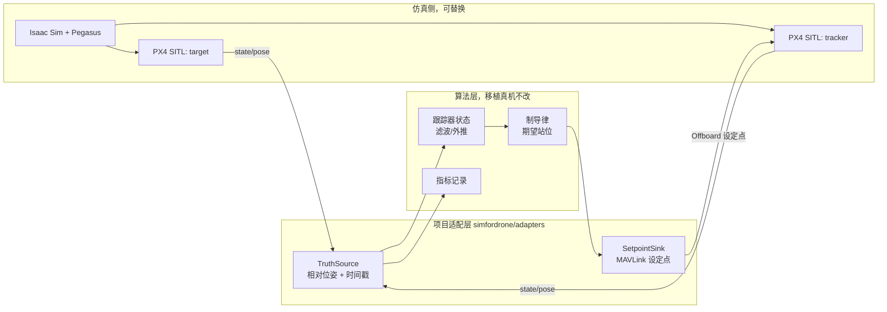

# 双机跟踪实施规划

本文规划从"双机观测已通"走到"视觉双机跟踪闭环"的落地顺序。每一阶段都有
**唯一通过条件**与**可留下的日志证据**，禁止跨阶段提前接入控制或视觉。

上游背景：两套框架的职责划分见
[Pegasus 与 Aerostack2 架构解读](pegasus_aerostack2_architecture.md)。

---

## 1. 起点：已确认可用的能力

| 能力 | 状态 | 证据/接口 |
|---|---|---|
| 双机 Isaac + 双 PX4 SITL + WebRTC | 可运行 | `scripts/start_dual_px4_scene.sh` |
| 双机真值位姿 | 已发布 | `/target_uav_0/state/pose`、`/tracker_uav_1/state/pose`（`PoseStamped`，ENU `map`，BEST_EFFORT） |
| 双机真值速度/加速度 | 已发布 | `.../state/twist`、`.../state/twist_inertial`、`.../state/accel` |
| tracker RGB-D | 已发布 | `.../front_camera/color/image_raw`、`color/camera_info`、`depth` |
| PX4 MAVLink 控制 | tracker 已验证 | `MAV_CMD_NAV_TAKEOFF`/`ARM_DISARM`/`NAV_LAND` 均 `ACCEPTED` |
| 图像与位姿时间基准对齐 | **未解决** | 两者时间基不一致，禁止用于视觉闭环 |

两条硬约束，直接影响架构选择：

1. **Pegasus 不提供高层控制通道。** `ROS2Backend` 的 `sub_control` 只订阅
   `/<ns><id>/control/rotor<i>/ref`（`Float64` 转子转速）。走这条路等于绕过 PX4
   的控制器，因此双机跟踪的**控制闭环必须落在 PX4 一侧**（MAVLink）。
2. **`pub_tf` 关闭。** 当前没有 TF 树；机体/相机变换必须由项目自有适配层发布，
   以保证坐标约定可审计、且真机可替换。

---

## 2. 目标架构：三层，仿真与算法解耦



**移植原则**：算法层不得 `import isaacsim / pegasus / omni`。真机替换只改适配层，
即把真值话题换成飞控遥测、把设定点下沉到同一 PX4 MAVLink 接口。

---

## 3. 阶段划分

### T0（P2.1）目标机单机验证 — ✅ 已完成（2026-09-18）

目标机的系统 ID 与端口此前从未单独验证，必须先补齐，避免双机阶段出现
"命令飞给了错误的无人机"。

实际实现（走已选定的 Offboard 路线）：

- `px4ctrl/vehicle.py`：角色 → 端口 / system id / ROS 命名空间的唯一映射
  （target `14540`/`1`，tracker `14541`/`2`）。
- `px4ctrl/controller.py` + `px4ctrl/fsm.py`：线性几何控制器与状态机，20 Hz 持续设定点，
  等待 ACK 期间也不中断流；所有退出路径兜底 `LAND` 并上锁。
- `px4ctrl/cli.py` + `scripts/run_px4ctrl.sh`：唯一入口，默认 dry-run，只有 `--execute`
  才飞行。
- **通过条件**：`max_altitude_m >= 0.8 * altitude`、落地、已上锁同时成立；
  `measure-hover` 还必须有可用标定样本。

结果：最高 `2.012 m`（目标 2.0 m）、站位误差均值 `0.041 m`、落地并确认上锁。
证据：`logs/offboard_hold/target-20260918-142828/`。

过程中确认的三条硬事实（细节见 [项目进度](progress.md)）：onboard 链路不下发
`STATUSTEXT`；本 PX4 分支的 `DO_SET_MODE` 按逐字节解析主/子模式；落地后需显式确认上锁
而非立即读取 `armed`。

### T1 真值适配层与离线回放 — 无控制

- 新增 `src/simfordrone/adapters/truth.py`：订阅两机位姿，输出统一记录

  ```text
  RelativePose(t, position_enu, orientation_quat_xyzw, range, bearing)
  ```

- 记录一段双机静止/单机起飞的 rosbag，离线回放校验：
  相对距离与初始站位几何一致，且**测出图像与位姿的实际时间偏差**（为 P3 铺路）。
- **通过条件**：同一段 bag 两次回放输出逐位一致（确定性）。
- 不接控制、不发设定点。

### T2 单机站位保持 — 只控 tracker

控制通道**已确定为 PX4 Offboard 姿态/推力设定点**（`SET_ATTITUDE_TARGET`，≥10 Hz 持续流），
实现位于 `px4ctrl/`（`controller.py` 与 `fsm.py`）；入口
`./scripts/run_px4ctrl.sh hold --role tracker --execute`。

- 输入先使用**常量真值目标点**（不依赖目标机飞行）：令 tracker 保持在
  目标点 `d` 米站位。
- 设定点是相对**出生点**的 local NED 偏移：PX4 的 local NED 原点由 EKF 在起飞点
  建立，与 Isaac 世界原点不重合，世界坐标换算留到 T3 由适配层完成。
- **通过条件**：稳定后站位误差 < 0.5 m 且能维持 20 s；`LAND` 正常收尾。
- 风险：Offboard 要求持续流，中断会触发 PX4 failsafe；实现采用单线程循环，在等待
  ACK 期间也保持流，并在所有退出路径兜底 `LAND`。

### T3 真值双机跟踪 — 目标机自主飞行，tracker 跟

- 目标机执行**确定性、可重复**的简单轨迹（悬停 → 直线 → 悬停）。
- tracker 用 T1 的真值相对位姿 + T2 的控制通道闭环。
- 制导律先做最简形式：相对位置 P 控制 + 固定偏航，不做视觉、不做 EKF。
- **通过条件**：全程无碰撞；站位误差 RMS 与最大值有明确数值；双机均安全降落。

### T4 指标与验收固化

- 统一指标：站位误差（均值/RMS/最大）、相对距离范围、LOS 角速率、
  控制饱和占比、是否触发 failsafe。
- 产物落盘为 JSON，便于与后续视觉方案对比。

### T5（P3）视觉替代真值

- 前置条件：T1 已量化图像/位姿时间偏差，并已实现时间转换。
- 视觉 6D 相对位姿替换真值，保持 T3 的制导与控制层不变（这正是分层的目的）。
- 之后才引入 EKF，把视觉量测作为带协方差的观测。

---

## 4. Aerostack2 的定位

Aerostack2 是**可选的上层替换**，不阻塞 T0–T4：

- 可在 T3 之后，用它的行为层（`go_to`/`follow_path`）替换 `GUIDE` 层；
- 但 Aerostack2 要求自身的状态估计/控制话题链，是与 PX4 并行的另一套集成，
  成本明显高于当前薄适配层；
- 结论：**先用手写薄适配层打通真值闭环**，再评估是否迁入 Aerostack2。

---

## 5. 明确不做的事

- 不在 T1–T3 中引入视觉位姿、EKF 或任何图像-控制耦合。
- 不放宽任何验收阈值以"让它通过"。
- 不在同一 MAVLink 端口并行运行多个客户端。
- 不把仿真独有的导入泄漏进算法层。
