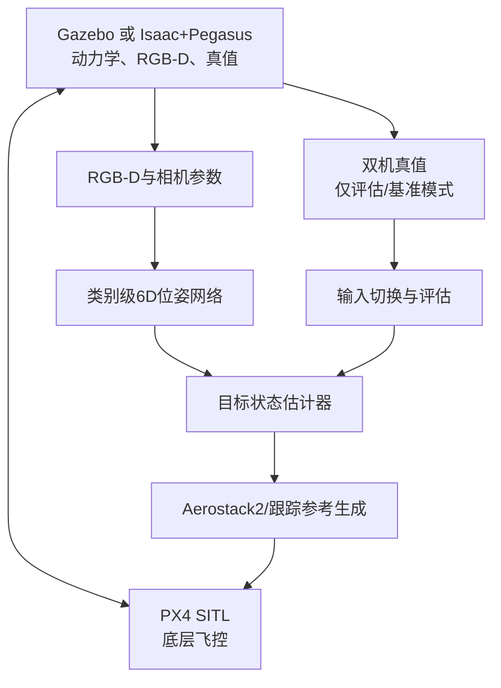

# 非合作四旋翼视觉位姿估计—状态估计—跟踪控制项目实施方案

> 版本：v1.0  
> 实施周期：2026年9月—11月  
> 核心目标：在11月真实动捕实验前，完成可复现、可替换数据源的双无人机视觉跟踪闭环；控制部分直接复用成熟方案，论文创新集中在四旋翼部件先验驱动的类别级6D位姿估计及其对状态估计的作用。

## 1. 项目目标与边界

### 1.1 最终目标

建立以下完整链路：

```text
目标无人机运动
  → 跟踪机前视RGB-D
  → 类别级6D位姿估计
  → 目标运动状态估计
  → 跟踪轨迹/参考生成
  → PX4控制跟踪机
  → 新的相对观测
```

系统必须同时支持：

1. PX4 SITL双无人机动力学闭环；
2. 高逼真RGB-D图像输出；
3. 跟踪机和目标机的连续位姿、速度真值；
4. 位姿网络、仿真真值、动捕和rosbag之间模块化切换；
5. 服务器headless运行、远程可视化与自动记录；
6. 11月将仿真输入替换为动捕和真实相机，而不改状态估计及控制主体。

### 1.2 研究边界

- **核心创新**：四旋翼部件先验和语义—空间理解驱动的类别级6D位姿估计，以及姿态信息对目标状态估计的贡献。
- **系统贡献**：感知—估计—控制闭环及sim-to-real验证。
- **不作为主要创新**：PX4底层控制、常规轨迹跟踪器、Aerostack2任务框架、通用滤波和仿真器。
- 第一阶段限定为一架跟踪机、一架目标机、固定前视相机、无遮挡或轻度遮挡；复杂避障、高速拦截和多目标跟踪不作为11月前的必需项。

## 2. 最终技术路线

### 2.1 主方案

```text
Isaac Sim + Pegasus Simulator + PX4 SITL + ROS 2 + Aerostack2
```

| 组件 | 职责 | 是否直接复用 |
|---|---|---|
| Isaac Sim | RTX场景渲染、RGB-D、相机标定信息、场景与目标模型 | 是 |
| Pegasus Simulator | 多旋翼动力学、PX4 MAVLink后端、多机实例 | 以官方项目为基础扩展 |
| PX4 SITL | 姿态/位置底层闭环、飞行模式和执行器控制 | 是 |
| ROS 2 | 模块通信、TF、仿真时间、rosbag | 是 |
| Aerostack2 | 任务管理、平台接口、轨迹/参考执行 | 选择性复用 |
| 位姿网络 | 从RGB-D输出目标相对相机6D位姿及置信度 | 自有核心模块 |
| 状态估计器 | 融合目标位姿、跟踪机状态，输出目标位置/速度/姿态等 | 自行实现或基于现有滤波扩展 |
| 仿真适配器 | 发布RGB-D、双机真值、统一时间戳和坐标变换 | 必须自行实现 |
| 评估器 | 对齐真值和估计，统计精度、延迟、丢失与闭环性能 | 必须自行实现 |

### 2.2 保底方案

```text
PX4 SITL + Gazebo Harmonic + ROS 2
```

Gazebo用于最先跑通双机控制、状态估计和接口。PX4官方已有`gz_x500`和`gz_x500_depth`模型，工程风险显著低于直接从Isaac Sim开始。

如果Isaac Sim与Pegasus的版本兼容问题影响进度，则：

- Gazebo继续承担动力学、PX4和控制闭环；
- Isaac Sim仅承担离线/半在线图像生成；
- 两套环境保持完全相同的ROS 2消息契约；
- 不能因为高逼真环境未完成而阻塞11月实验。

### 2.3 现有项目基础

1. 主仿真基础：[PegasusSimulator/PegasusSimulator](https://github.com/PegasusSimulator/PegasusSimulator)
2. 飞控与Gazebo基准：[PX4/PX4-Autopilot](https://github.com/PX4/PX4-Autopilot)
3. 上层任务框架：[aerostack2/aerostack2](https://github.com/aerostack2/aerostack2)
4. 可选轨迹规划器：[ZJU-FAST-Lab/Elastic-Tracker](https://github.com/ZJU-FAST-Lab/Elastic-Tracker)

Elastic-Tracker不是项目底座。它主要解决跟踪轨迹规划问题，仅在基础闭环完成后、确实需要障碍规避或可见性约束时接入。

## 3. 系统架构



### 3.1 主数据流

1. 仿真器根据PX4电机/控制量更新跟踪机状态；
2. 目标机按照预设轨迹、另一PX4实例或脚本运动；
3. 跟踪机前视相机输出同步RGB-D和相机参数；
4. 位姿网络输出目标相对于相机的6D位姿、置信度及协方差；
5. 状态估计器结合跟踪机自身状态，估计目标世界位置、速度、姿态和角速度；
6. 跟踪策略生成跟踪机位置、速度或轨迹参考；
7. Aerostack2/PX4接口向PX4发送参考量；
8. 独立评估器使用仿真/动捕真值评价感知、估计和闭环。

### 3.2 真值隔离原则

真值默认只进入评估器，不允许暗中进入位姿网络或最终视觉闭环。只有`sim_truth`和`mocap_truth`上界实验允许显式使用真值作为状态估计输入，且结果必须与网络闭环分开报告。

## 4. 硬件与进程分配

现有服务器的两张RTX A6000足够当前规模，不需要升级GPU。

| 资源 | 建议任务 |
|---|---|
| GPU 0（A6000 48 GB） | Isaac Sim、Pegasus、RTX实时RGB-D渲染 |
| GPU 1（A6000 48 GB） | 位姿估计、检测/分割等神经网络推理 |
| CPU | 两个PX4 SITL实例、ROS 2、Aerostack2、状态估计、记录与评估 |

注意：两张卡的48 GB显存不会自动合并。在线闭环阶段应采用进程级GPU隔离，而不是让Isaac Sim和网络共同争用两张卡。

建议初始配置：

| 参数 | 初始值 |
|---|---:|
| RGB-D分辨率 | 640×480 |
| 相机频率 | 20–30 Hz |
| 位姿网络目标频率 | ≥15–20 Hz |
| 物理仿真频率 | 200–250 Hz |
| 跟踪控制频率 | 50 Hz |
| 渲染模式 | RTX Real-Time/低延迟模式 |
| 运行方式 | Headless，按需WebRTC查看 |
| 多GPU渲染 | 初期关闭 |

在线闭环不使用Path Tracing；高质量离线数据生成可单独建立Path Tracing配置。

## 5. ROS 2接口设计

### 5.1 仿真与真值话题

```text
/clock
/tf
/tf_static

/camera/color/image_raw
/camera/depth/image_raw
/camera/color/camera_info

/sim/ego/ground_truth/odometry
/sim/target/ground_truth/odometry
```

推荐使用`nav_msgs/Odometry`表达连续真值，因为其中同时包含位姿、线速度、角速度及协方差位置。

### 5.2 感知与状态估计话题

```text
/perception/target_pose
/perception/target_pose/debug
/estimation/target_state
/estimation/target_path
```

建议定义统一目标观测消息：

```text
TargetMeasurement
  std_msgs/Header header
  string source
  geometry_msgs/Pose pose
  float64[36] covariance
  float32 confidence
  bool valid
```

其中`source`至少支持：

```text
sim_truth
sim_network
mocap_truth
real_network
rosbag
```

### 5.3 控制话题

具体话题名服从Aerostack2/PX4接口，但系统内部统一生成以下一种参考：

- 位置＋偏航参考；或
- 位置、速度、加速度轨迹参考。

第一阶段优先位置/速度参考，不直接输出电机指令，也不重新设计PX4内环。

## 6. 坐标系、标定与时间同步

### 6.1 坐标系定义

建议固定以下TF树：

```text
world/map
├── ego_base_link
│   └── camera_link
│       └── camera_optical_frame
└── target_base_link
    └── target_canonical_frame
```

必须明确并测试：

- Isaac/Gazebo世界坐标约定；
- ROS REP-103的ENU/FLU；
- PX4内部NED/FRD；
- 相机光学坐标系；
- 网络训练数据采用的目标规范坐标系。

禁止仅通过“看起来方向正确”判断变换。应为每条轴设计单元测试：目标沿世界坐标轴平移或绕单轴旋转时，网络真值和TF计算结果必须符合预期。

### 6.2 相对位姿真值

设：

- `T_W_E`：跟踪机机体相对世界的位姿；
- `T_E_C`：相机相对跟踪机机体的外参；
- `T_W_T`：目标机规范坐标系相对世界的位姿。

则目标相对相机的真值为：

```text
T_C_T = inverse(T_W_E * T_E_C) * T_W_T
```

它必须与RGB-D使用同一仿真时刻，不能用“收到消息时的最新位姿”代替图像曝光时刻的位姿。

### 6.3 时间原则

- 所有ROS 2节点设置`use_sim_time=true`；
- 仿真器发布唯一`/clock`；
- 图像、深度、相机参数、双机真值使用一致时间基准；
- 状态估计器根据`header.stamp`而不是系统接收时间更新；
- 记录推理开始、推理完成、状态估计输出和控制发送时间；
- 11月动捕阶段必须完成动捕时钟与相机/机载计算机时钟对齐。

## 7. 运行模式

| 模式 | 输入 | 目的 |
|---|---|---|
| `sim_truth` | 仿真相对位姿真值 | 隔离感知误差，调试状态估计与控制 |
| `sim_network` | 仿真RGB-D经过位姿网络 | 完整视觉闭环 |
| `sim_degraded` | 加噪声、延迟、掉帧的网络输出 | 鲁棒性和稳定性测试 |
| `mocap_truth` | 动捕真值 | 真实系统控制上界与链路检查 |
| `real_network` | 真实相机经过位姿网络 | 最终实验模式 |
| `rosbag` | 离线记录 | 可复现回放、调参与消融 |

切换模式只允许改变输入适配器和配置文件，不得修改状态估计与控制代码。

## 8. 软件仓库建议结构

```text
uav_visual_tracking_ws/
├── src/
│   ├── sim_bridge/              # Gazebo/Isaac图像、真值和TF适配
│   ├── target_pose_ros/         # 位姿网络ROS 2封装
│   ├── target_state_estimator/  # 目标状态估计
│   ├── tracking_reference/      # 跟踪策略/参考生成
│   ├── measurement_mux/         # truth/network/mocap/bag输入切换
│   ├── mocap_bridge/            # 11月动捕适配
│   ├── experiment_manager/      # 启动、参数和场景管理
│   └── evaluation_tools/        # 对齐、统计、绘图和报告
├── config/
│   ├── gazebo_truth.yaml
│   ├── isaac_truth.yaml
│   ├── isaac_network.yaml
│   ├── mocap_truth.yaml
│   └── real_network.yaml
├── launch/
├── scenarios/
├── scripts/
├── tests/
├── bags/
└── docs/
```

第三方仓库建议固定commit或release，不直接在其源码中混入大量业务代码。自定义功能通过ROS 2包、Isaac扩展或独立适配器实现。

## 9. 分阶段实施计划

### 阶段A：接口冻结与最小基准（9月第1周）

- 固定Ubuntu、ROS 2、PX4、Gazebo、Isaac Sim和Pegasus版本矩阵；
- 建立主仓库和依赖说明；
- 冻结话题、消息、TF树和坐标约定；
- 实现`measurement_mux`和假数据发布器；
- 用假目标轨迹验证状态估计器和跟踪参考接口。

**验收**：不启动神经网络和复杂仿真，也能用合成消息跑通“观测→估计→参考”链路。

### 阶段B：Gazebo/PX4保底闭环（9月第2—3周）

- 复现PX4 `gz_x500_depth`；
- 启动跟踪机和目标机两个实例；
- 目标机执行圆、8字、变速直线等轨迹；
- 发布双机连续真值和相对相机真值；
- 在`sim_truth`模式下完成跟踪闭环；
- 记录rosbag并自动计算跟踪误差。

**验收**：连续运行30分钟；PX4连接稳定；跟踪机不失控；所有消息时间戳一致。

### 阶段C：状态估计与控制定型（9月第4周）

- 确定状态向量、过程模型和观测模型；
- 加入测量协方差、异常值拒绝和短时丢失预测；
- 建立真值输入下的性能上界；
- 明确姿态信息进入状态估计的位置；
- 完成静态目标、匀速、加速和转弯轨迹测试。

**验收**：状态估计和控制不依赖具体仿真器；切换输入源无需重新编译主体代码。

### 阶段D：Isaac Sim/Pegasus高逼真环境（10月第1—2周）

- 先复现Pegasus官方单机PX4示例：解锁、起飞、悬停、降落；
- 再扩展为跟踪机和目标机；
- 添加跟踪机前视RGB-D相机；
- 实现Isaac ROS 2桥，发布图像、双机真值、TF和时间；
- 在`sim_truth`模式下完成高逼真环境闭环；
- 配置headless和WebRTC远程查看。

**止损点**：若5个有效工作日内仍不能稳定解锁、悬停并发布同步数据，立即保留Gazebo闭环，将Isaac转为图像生成环境，不允许无限投入版本调试。

### 阶段E：位姿网络闭环（10月第3—4周）

- 将位姿网络封装为ROS 2节点；
- GPU 1独占推理，GPU 0独占仿真；
- 输出位姿、置信度、协方差和有效标志；
- 比较`sim_truth`与`sim_network`；
- 注入图像模糊、光照变化、遮挡、深度噪声和未见无人机模型；
- 测量端到端延迟并测试延迟补偿。

**验收**：网络闭环能够持续跟踪，失败时系统可判无效、短时预测并安全退出，而不是把错误位姿直接送给控制器。

### 阶段F：11月真实动捕实验准备

- 提前完成`mocap_bridge`空壳及回放测试；
- 准备目标机和跟踪机动捕刚体；
- 标定动捕刚体到机体系、机体系到相机系、目标刚体到规范坐标系；
- 同步动捕、相机、PX4和计算机时钟；
- 先以`mocap_truth`飞行，验证真实控制链路；
- 再以`real_network`闭环，动捕只作真值；
- 采集连续RGB-D、网络输出、PX4状态、动捕真值和控制量。

## 10. 实验轨迹与场景

### 10.1 目标轨迹

由易到难：

1. 静态悬停；
2. 匀速直线；
3. 圆形轨迹；
4. 8字轨迹；
5. 分段加减速；
6. 带偏航/姿态变化的转弯；
7. 短时出视野后重新进入；
8. 轻度遮挡和背景干扰。

每类轨迹固定随机种子、初始距离、相对高度和速度范围，保证不同方法可以公平重放。

### 10.2 域随机化

- 无人机CAD型号、尺寸和纹理；
- 背景、光照方向/强度和天气外观；
- 相机噪声、曝光、运动模糊；
- 深度缺失、飞点、量化噪声；
- 相机外参小扰动；
- 网络推理延迟、消息抖动和随机丢帧。

## 11. 评价指标

### 11.1 位姿估计

- 平移误差；
- 旋转误差；
- ADD/ADD-S或对称性感知指标；
- 有效预测率；
- 目标丢失率与重捕获时间；
- 推理频率及端到端延迟。

### 11.2 状态估计

- 目标位置RMSE；
- 目标速度RMSE；
- 姿态/推力方向误差；
- 角速度误差（若估计）；
- NIS/NEES或协方差一致性；
- 遮挡/丢帧后的漂移及恢复时间。

### 11.3 闭环跟踪

- 相对位置跟踪RMSE；
- 期望距离误差；
- 目标保持在视野内的比例；
- 最小安全距离；
- 控制输入平滑度；
- 闭环成功率；
- 连续稳定运行时间。

### 11.4 建议最低性能门槛

| 指标 | 第一阶段门槛 |
|---|---:|
| 仿真实时率 | ≥1.0 |
| RGB-D稳定频率 | ≥20 Hz |
| 网络推理频率 | ≥15 Hz |
| 感知至控制总延迟 | ≤100 ms（初期） |
| 连续运行时间 | ≥30 min |
| 图像—真值错位 | ≤1个图像周期，最终应精确同步 |
| GPU显存峰值 | 单卡≤约85% |

这些是工程验收门槛，不是最终论文性能结论；后续根据控制稳定性进一步收紧。

## 12. 必做对照与消融

为了证明位姿与姿态信息对系统有实际价值，至少比较：

1. 仿真/动捕完整真值输入：系统性能上界；
2. 仅目标位置观测，不使用姿态；
3. 位置＋完整6D位姿观测；
4. 原始逐帧位姿直接控制；
5. 位姿经过状态估计后控制；
6. 无延迟补偿与有延迟补偿；
7. 见过型号与未见型号；
8. 理想深度与退化深度。

关键科学问题不是“控制器是否先进”，而是：

> 类别级四旋翼6D位姿，尤其是姿态/推力方向信息，能否在未见目标、观测噪声和短时遮挡下改善目标状态估计及闭环跟踪。

## 13. 风险及退路

| 风险 | 对策 |
|---|---|
| Isaac Sim、Pegasus、PX4版本不兼容 | 固定版本和commit；设置5日止损点；Gazebo保持可用 |
| Pegasus不自动发布图形传感器 | 自写Isaac ROS 2相机/真值桥，不依赖MAVLink传图像 |
| ROS 2图像复制导致延迟 | 同机运行、降低分辨率、使用组件/共享内存或压缩仅用于远程查看 |
| 坐标系错误 | TF树、单轴运动测试和离线数值对照 |
| 网络频率不足 | 裁剪ROI、异步推理、TensorRT/混合精度；先保证15–20 Hz |
| 网络短时误检导致控制发散 | 置信度门控、创新检验、超时预测和安全悬停/退出 |
| 动捕与相机不同步 | 硬件或PTP/NTP同步、时间偏移标定、全链路时间戳记录 |
| 11月现场时间不足 | 事前完成动捕适配器和rosbag回放；先真值闭环，再网络闭环 |

## 14. 开工清单

### 软件与版本

- [ ] 确认Ubuntu版本、NVIDIA驱动、CUDA和Isaac Sim兼容性
- [ ] 确认ROS 2发行版与Gazebo版本
- [ ] 克隆并固定PX4-Autopilot版本
- [ ] 克隆并固定Pegasus Simulator版本
- [ ] 安装Aerostack2最小所需组件
- [ ] 建立依赖锁定和一键环境检查脚本

### Gazebo基准

- [ ] 跑通`gz_x500_depth`
- [ ] 跑通双PX4 SITL实例
- [ ] 目标机执行预设轨迹
- [ ] 发布双机Odometry真值
- [ ] 计算相对相机位姿真值
- [ ] 完成`sim_truth`闭环

### Isaac/Pegasus

- [ ] 单机解锁、起飞、悬停、降落
- [ ] 双机实例和端口隔离
- [ ] RGB-D和CameraInfo发布
- [ ] 双机真值、TF和`/clock`发布
- [ ] Headless连续运行30分钟
- [ ] WebRTC或RViz2远程调试

### 感知—估计—控制

- [ ] 位姿网络ROS 2封装
- [ ] 输出置信度和协方差
- [ ] 状态估计器接入
- [ ] 输入适配器热切换
- [ ] Aerostack2/PX4参考接口接入
- [ ] 异常观测与丢帧安全策略
- [ ] rosbag自动记录和评估

### 11月动捕

- [ ] 两架无人机刚体标记设计
- [ ] 三组外参/坐标系标定流程
- [ ] 动捕桥和消息格式
- [ ] 时间同步方案
- [ ] `mocap_truth`控制上界实验
- [ ] `real_network`视觉闭环实验

## 15. 最终决策摘要

1. **项目主底座**：Pegasus Simulator，而不是Elastic-Tracker。
2. **高逼真主环境**：Isaac Sim＋Pegasus＋PX4 SITL。
3. **稳定保底环境**：PX4 SITL＋Gazebo Harmonic。
4. **上层工程框架**：Aerostack2选择性复用，不重新设计底层控制。
5. **Elastic-Tracker定位**：后期可选轨迹规划器，不阻塞基础闭环。
6. **算力安排**：GPU 0仿真渲染，GPU 1位姿网络；两张A6000足够。
7. **架构核心**：统一观测消息、TF树和时间戳，使仿真真值、网络、动捕和rosbag可替换。
8. **实施原则**：先真值闭环，再网络闭环；先Gazebo可靠性，再Isaac高逼真；11月先动捕真值上界，再真实视觉闭环。

---

## 参考入口

- [Pegasus Simulator](https://github.com/PegasusSimulator/PegasusSimulator)
- [PX4 Autopilot](https://github.com/PX4/PX4-Autopilot)
- [PX4 Gazebo Simulation](https://docs.px4.io/main/en/sim_gazebo_gz/)
- [Aerostack2](https://github.com/aerostack2/aerostack2)
- [Elastic Tracker](https://github.com/ZJU-FAST-Lab/Elastic-Tracker)
- [Isaac Sim Documentation](https://docs.isaacsim.omniverse.nvidia.com/latest/)

